# Bank Complaint Management DevOps Infrastructure

> Plateforme DevOps Kubernetes, GitOps, CI/CD et observabilite pour le deploiement, la securisation et la supervision d'une application de gestion des reclamations bancaires.

## Presentation du projet

Ce repository constitue la couche **Infrastructure as Code** du projet Bank Complaint Management. Il separe volontairement l'infrastructure des repositories frontend et backend afin de rendre les changements d'environnement versionnables, auditables et reproductibles.

Le projet met en oeuvre une chaine de livraison moderne : les applications sont testees et conteneurisees par GitHub Actions, leurs images sont publiees dans GitHub Container Registry, puis ce repository est automatiquement mis a jour avec le SHA exact de l'image. Argo CD detecte ensuite cette modification Git et synchronise le cluster Kubernetes.

Cette organisation demontre une approche professionnelle de plateforme : deploiements declaratifs, separation des responsabilites, rollback facilite, controle des ressources, durcissement des conteneurs et supervision centralisee.

Depot d'infrastructure Kubernetes du projet **Bank Complaint Management**.

Ce depot contient les manifests Kubernetes, la configuration GitOps Argo CD, les ressources de stockage, les politiques reseau et la stack d'observabilite necessaires au deploiement de l'application.

## Stack technologique

| Domaine | Technologies utilisees |
| --- | --- |
| Orchestration | Kubernetes |
| GitOps | Argo CD |
| CI/CD applicatif | GitHub Actions |
| Images de conteneurs | Docker, GitHub Container Registry (GHCR) |
| Frontend | Application frontend conteneurisee, servie par un conteneur web |
| Backend | .NET 9, ASP.NET Core, API conteneurisee |
| Base de donnees | Microsoft SQL Server 2019 |
| Routage | Kubernetes Ingress avec NGINX |
| Metriques | Prometheus, kube-state-metrics, Node Exporter |
| Dashboards | Grafana |
| Logs | Loki, Grafana Alloy |
| Traces | Tempo, OpenTelemetry OTLP |
| Configuration | ConfigMaps et Secrets Kubernetes |
| Stockage | PersistentVolumeClaims Kubernetes |
| Cluster local | Minikube avec driver Docker et CNI Calico |

## Application deployee

L'application est accessible localement via l'Ingress Kubernetes a l'adresse `http://bank-complaint.local`. La capture suivante montre l'ecran de creation d'une nouvelle reclamation apres le deploiement de la plateforme.

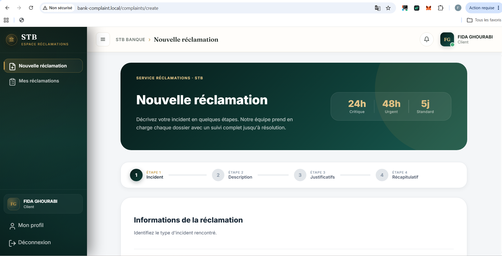

## Architecture complete du cluster Kubernetes

Le diagramme ci-dessous presente la structure logique du cluster, les namespaces, les workloads Kubernetes, les Services, les volumes et les flux GitOps et d'observabilite. Le nombre de noeuds du cluster depend de l'environnement d'execution et n'est pas impose par ce repository.

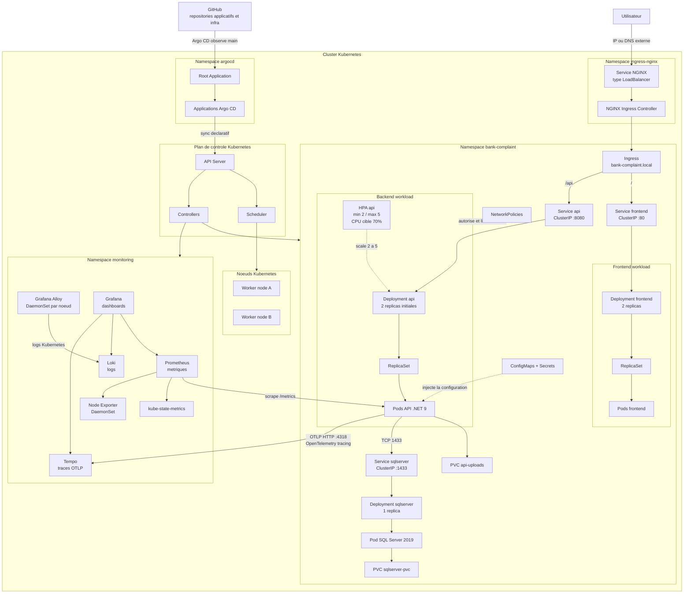

### Vue simple du cluster applicatif

Ce schema montre uniquement les composants reels deployes dans le namespace `bank-complaint`, sans detailler les objets Kubernetes intermediaires :

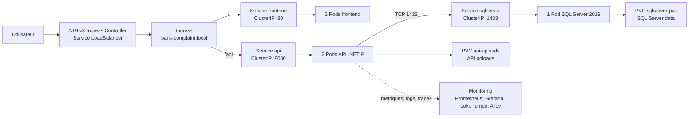

Cette vue resume la topologie actuelle : **2 Pods frontend**, **2 Pods API** et **1 Pod SQL Server**. Le HPA peut augmenter le nombre de Pods API jusqu'a 5 selon l'utilisation CPU ; les deux Pods API representent donc l'etat initial declare par le Deployment.

### Detail des flux d'observabilite

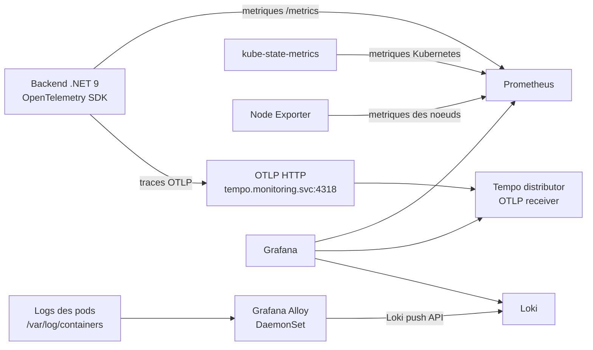

Dans l'implementation actuelle, **Alloy collecte les logs Kubernetes et les envoie a Loki**. Les **traces OpenTelemetry du backend sont envoyees directement a Tempo via OTLP HTTP sur le port `4318`**. Tempo expose egalement OTLP gRPC sur `4317`. Le `NetworkPolicy` de l'API autorise le flux vers Tempo sur `4318`.

### Hierarchie et placement Kubernetes

```text
Cluster Kubernetes
├── Namespace argocd
│   ├── Root Application
│   └── Applications Argo CD
├── Namespace ingress-nginx
│   ├── Service NGINX Ingress Controller (LoadBalancer)
│   └── NGINX Ingress Controller Pods
├── Namespace bank-complaint
│   ├── Ingress
│   ├── Service frontend -> Deployment -> ReplicaSet -> Pods frontend
│   ├── Service api -> Deployment -> ReplicaSet -> Pods API
│   │   └── HPA api: 2 a 5 replicas selon CPU
│   ├── PVC api-uploads
│   ├── Service sqlserver -> Deployment -> Pod SQL Server
│   ├── PVC sqlserver-pvc
│   ├── ConfigMaps et Secrets
│   └── NetworkPolicies
└── Namespace monitoring
    ├── Prometheus -> PVC
    ├── Grafana -> PVC
    ├── Loki -> PVC
    ├── Tempo -> PVC
    ├── Alloy DaemonSet -> logs des noeuds -> Loki
    ├── kube-state-metrics
    └── Node Exporter DaemonSet
```

Cette organisation separe clairement le plan applicatif, la plateforme d'observabilite et le controle GitOps. Les Pods sont geres par leurs Deployments ou DaemonSets, les Services fournissent la decouverte reseau interne et les PVC assurent la persistance declaree.

### Hierarchie des ressources Kubernetes

Dans Kubernetes, chaque objet a une responsabilite differente :

| Objet | Role dans ce projet |
| --- | --- |
| Ingress | Recoit les requetes HTTP et choisit le Service cible selon le chemin `/` ou `/api`. |
| Service | Fournit une adresse reseau stable aux Pods. Les Services applicatifs sont de type `ClusterIP`. |
| Deployment | Declare le nombre souhaite de replicas et gere les mises a jour des Pods. |
| ReplicaSet | Cree et maintient le nombre de Pods demande par un Deployment. |
| Pod | Execute le conteneur frontend, API ou SQL Server. |
| PVC | Demande du stockage persistant pour SQL Server ou les uploads de l'API. |
| HPA | Ajuste automatiquement le nombre de Pods API entre 2 et 5 selon le CPU. |

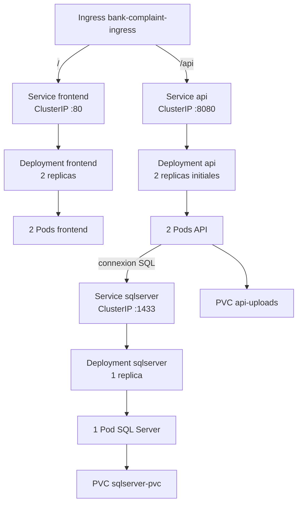

La lecture du diagramme se fait de haut en bas : l'Ingress route vers un Service, le Service cible un Deployment, le Deployment gere les Pods, et les Pods utilisent les PVC lorsqu'ils ont besoin de stockage persistant. Le frontend et l'API ont chacun 2 Pods au demarrage ; SQL Server a 1 Pod ; l'API peut ensuite etre augmentee jusqu'a 5 Pods par le HPA.

### Flux reseau et observabilite

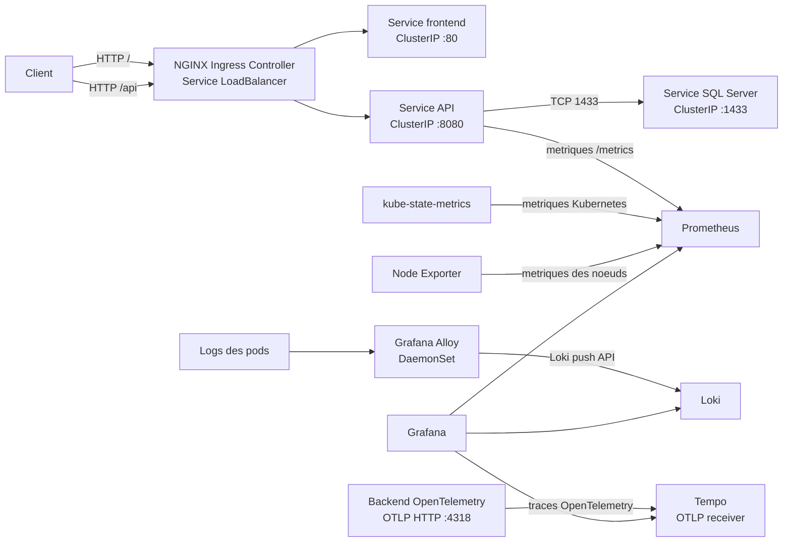

Les NetworkPolicies reduisent les flux entrants et sortants de l'API. Prometheus collecte les metriques de l'API, de kube-state-metrics et de Node Exporter. Alloy collecte les logs des pods et les envoie a Loki. Le backend instrumente avec OpenTelemetry envoie ses traces directement a Tempo via OTLP HTTP sur le port `4318`.

Le point d'entree externe est le Service du **NGINX Ingress Controller**, configure dans l'environnement Kubernetes avec `type: LoadBalancer`. La ressource `Ingress` `bank-complaint-ingress` ne porte pas elle-meme le type `LoadBalancer` : elle definit les regles de routage vers les Services internes `frontend` et `api`, qui restent de type `ClusterIP`.

### Parcours d'une requete

1. L'utilisateur accede a `bank-complaint.local` via l'Ingress NGINX.
2. Le chemin `/` est route vers le Service frontend.
3. Le chemin `/api` est route vers le Service backend.
4. L'API communique avec SQL Server sur le reseau interne du cluster.
5. Prometheus collecte les metriques exposees par l'API et par les composants Kubernetes.
6. Grafana exploite les sources de donnees configurees pour fournir une vue operationnelle.

## Vue d'ensemble

L'architecture deployee est composee de trois namespaces principaux :

- `bank-complaint` : API backend, frontend, SQL Server et leurs services associes ;
- `monitoring` : Prometheus, Grafana, Loki, Tempo, Alloy, kube-state-metrics et Node Exporter ;
- `argocd` : Applications Argo CD qui declarent les sources Git et les destinations Kubernetes.

Le trafic applicatif entre par un Ingress NGINX :

| Route | Service | Port |
| --- | --- | --- |
| `http://bank-complaint.local/` | frontend | 80 |
| `http://bank-complaint.local/api` | api | 8080 |

Le Service du NGINX Ingress Controller est de type `LoadBalancer` et fournit l'adresse externe du cluster. Les services applicatifs `frontend`, `api` et `sqlserver` sont de type `ClusterIP` et ne sont donc pas exposes directement sur Internet. Le manifest `k8s/ingress/ingress.yaml` declare les regles de routage, tandis que l'installation et la configuration du Service LoadBalancer du contrôleur sont gerees par la plateforme Kubernetes ou par l'installation NGINX Ingress.

## Architecture Kubernetes

### Application

- **Frontend** : Deployment `frontend`, 2 replicas, image publiee sur GitHub Container Registry ;
- **Backend** : Deployment `api`, 2 replicas, image publiee sur GitHub Container Registry ;
- **SQL Server** : SQL Server 2019, 1 replica, avec un PersistentVolumeClaim ;
- **Stockage des uploads** : PersistentVolumeClaim monte dans le conteneur backend ;
- **Exposition externe** : Service du NGINX Ingress Controller de type `LoadBalancer` ;
- **Routage** : ressource Ingress NGINX sur l'hote `bank-complaint.local`.

Les Services applicatifs sont de type `ClusterIP` : les composants restent accessibles dans le cluster. Le Service `LoadBalancer` du contrôleur NGINX constitue le point d'entree externe, et la ressource Ingress constitue le point de routage HTTP declare par cette infrastructure.

Les Deployments definissent des requests et limits de ressources ainsi que des probes de demarrage, de disponibilite et de vivacite pour l'API. Le frontend et SQL Server disposent egalement de probes ou de ressources Kubernetes selon leur role.

### Securite Kubernetes

Les manifests appliquent notamment :

- execution des conteneurs applicatifs avec un utilisateur non root ;
- desactivation de l'escalade de privileges et suppression des capabilities Linux pour l'API et le frontend ;
- desactivation de l'automontage du token du ServiceAccount lorsque celui-ci n'est pas necessaire ;
- utilisation d'un `imagePullSecret` `ghcr-secret` pour recuperer les images privees GHCR ;
- separation des valeurs de configuration et des secrets via `ConfigMap` et `Secret` ;
- NetworkPolicies limitant les flux autorises entre l'Ingress, l'API, SQL Server, DNS et la stack d'observabilite.

Les valeurs sensibles doivent etre gerees par les Secrets Kubernetes et ne doivent pas etre ajoutees en clair dans un commit Git.

### Observabilite

Le namespace `monitoring` contient les composants suivants :

- **Prometheus** pour la collecte des metriques ;
- **Grafana** pour la visualisation ;
- **Loki** pour les logs ;
- **Tempo** pour les traces ;
- **Grafana Alloy** pour la collecte et l'expedition des donnees d'observabilite ;
- **kube-state-metrics** pour les metriques des objets Kubernetes ;
- **Node Exporter** pour les metriques des noeuds.

L'API est configuree pour etre scrapee par Prometheus sur le port `8080` et le chemin `/metrics`.

Cette stack fournit les briques necessaires pour suivre la sante des workloads, les metriques des noeuds, l'etat des objets Kubernetes, les logs et les traces. Elle permet de reduire le temps de diagnostic et d'observer le comportement de la plateforme depuis Grafana.

## Decisions techniques et points forts

### Deploiements declaratifs et auditables

L'etat attendu du cluster est decrit en YAML et versionne dans Git. Chaque modification d'infrastructure laisse une trace dans l'historique du repository et peut etre revue avant synchronisation.

### Separation claire des responsabilites

Les repositories applicatifs construisent et publient les images. Ce repository decrit leur execution dans Kubernetes. Argo CD assure la convergence entre Git et le cluster. Cette separation limite les modifications manuelles et clarifie le diagnostic lorsqu'un deploiement echoue.

### Traçabilite des versions

Les workflows utilisent le SHA du commit comme tag d'image dans les Deployments. Une version Kubernetes peut donc etre reliee a son commit source, ce qui facilite l'analyse d'incident et le retour vers une version connue.

### Disponibilite et controle des ressources

L'API et le frontend sont deployes avec deux replicas. Les requests, limits et probes Kubernetes presentes dans les manifests aident le scheduler, le kubelet et le Service a prendre des decisions coherentes lors du demarrage ou d'une degradation d'un pod.

### Autoscaling de l'API

Un `HorizontalPodAutoscaler` Kubernetes est declare dans `k8s/api/hpa.yaml` pour le Deployment `api` :

| Parametre | Valeur |
| --- | --- |
| Minimum | 2 replicas |
| Maximum | 5 replicas |
| Metrique | Utilisation CPU moyenne |
| Cible | 70 % |
| Ressource cible | Deployment `api` |

Le fonctionnement est le suivant :

1. Les deux replicas initiales assurent une capacite minimale et evitent de reduire l'API a zero instance.
2. Le Metrics Server du cluster fournit la consommation CPU des Pods au HPA.
3. Si l'utilisation CPU moyenne depasse durablement 70 %, le HPA augmente progressivement le nombre de replicas, jusqu'a 5.
4. Lorsque la charge diminue, Kubernetes peut reduire le nombre de replicas, sans descendre sous 2.
5. Le Service `api` continue de distribuer le trafic vers les Pods disponibles et prets.

L'autoscaling concerne ici le nombre de Pods de l'API, pas le nombre de noeuds du cluster. Le dimensionnement des noeuds depend de l'infrastructure Kubernetes sous-jacente. Le frontend reste configure a 2 replicas fixes et SQL Server a 1 replica, avec stockage persistant.

Le HPA s'appuie sur les `resources.requests.cpu` definis dans le Deployment API : la cible de 70 % est calculee par rapport a la request CPU du conteneur. Pour que cette fonctionnalite soit effective, le cluster doit fournir une API de metriques fonctionnelle, typiquement via Metrics Server.

### Securite en profondeur

Le projet combine identites non root, capabilities retirees, interdiction de l'escalade de privileges, Secrets Kubernetes, imagePullSecret et NetworkPolicies. Ces controles reduisent la surface d'attaque et limitent les communications aux flux necessaires.

### Exploitation reproductible

Les memes manifests peuvent etre relus, verifies et synchronises par Argo CD. Docker Compose fournit en parallele une execution locale des trois composants principaux : frontend, API et SQL Server.

## Responsabilites par composant

| Composant | Responsabilite |
| --- | --- |
| Frontend | Interface utilisateur exposee par le Service `frontend` |
| API | Logique backend, endpoint de sante, metriques et acces a la base |
| SQL Server | Persistance relationnelle de l'application |
| Ingress NGINX | Routage externe vers le frontend et l'API |
| Argo CD | Synchronisation Git vers Kubernetes, prune et self-heal |
| Prometheus | Collecte des metriques |
| Grafana | Visualisation et exploitation des donnees |
| Loki | Stockage et consultation des logs |
| Tempo | Stockage des traces |
| Alloy | Collecte et transmission des donnees d'observabilite |

## GitOps avec Argo CD

Argo CD utilise ce depot comme source de verite et surveille la branche `main`.

Le point d'entree est :

```text
argocd/root-application.yaml
```

Cette Application racine charge les Applications declarees dans `argocd/apps/`. Ces Applications ciblent les repertoires Kubernetes correspondants et activent la synchronisation automatique, le prune et le self-heal.

Les sync waves organisent le deploiement : les namespaces et les composants de fondation sont appliques avant les applications frontend et backend.

Pour installer l'Application racine dans un cluster disposant deja d'Argo CD :

```bash
kubectl apply -f argocd/namespace.yaml
kubectl apply -f argocd/root-application.yaml
```

La commande precedente demande a Argo CD de prendre en charge les ressources declarees dans ce depot. Le cluster doit disposer au prealable des composants externes references par les manifests, notamment un Ingress Controller NGINX et les CRD necessaires a Argo CD.

## Chaine CI/CD des images applicatives

Les repositories frontend et backend possedent chacun leur propre workflow GitHub Actions. Sur une Pull Request vers `main`, le workflow installe les dependances, compile le projet et execute les tests. La publication et la mise a jour de ce depot d'infrastructure sont reservees aux pushes sur `main`.

### Frontend

Le workflow frontend :

1. installe Node.js 20 et les dependances avec `npm ci` dans `bank-app` ;
2. execute les tests unitaires en mode `ChromeHeadless` ;
3. construit l'image Docker depuis `./bank-app` ;
4. publie les tags `${{ github.sha }}` et `latest` dans GHCR ;
5. clone ce depot dans le dossier `infra` avec `secrets.INFRA_REPO_TOKEN` ;
6. remplace l'image dans `k8s/frontend/deployment.yaml` par l'image portant le SHA du commit ;
7. commit et pousse la modification dans le depot d'infrastructure.

### Backend

Le workflow backend :

1. installe le SDK .NET 9 ;
2. restaure les dependances de `BankComplaintManagement.sln` ;
3. compile la solution en configuration `Release` ;
4. execute les tests .NET ;
5. construit et publie dans GHCR les tags `${{ github.sha }}` et `latest` ;
6. clone ce depot dans le dossier `infra` avec `secrets.INFRA_REPO_TOKEN` ;
7. remplace l'image dans `k8s/api/deployment.yaml` par l'image portant le SHA du commit ;
8. commit et pousse la modification dans le depot d'infrastructure.

### Flux de deploiement

```text
Push sur main (frontend ou backend)
	|
	v
Build + tests + image Docker
	|
	v
Publication de l'image dans GHCR
	|
	v
Mise a jour du Deployment dans ce depot
	|
	v
Commit automatique dans main
	|
	v
Argo CD detecte le changement et synchronise le cluster
```

Le SHA du commit est utilise comme tag d'image dans les Deployments Kubernetes. Cela permet de relier une version deployee a un commit precis, tandis que le tag `latest` est egalement publie par les workflows.

Les workflows utilisent les variables et secrets suivants :

| Element | Utilisation |
| --- | --- |
| `GITHUB_TOKEN` | Authentification GHCR pour publier les images |
| `INFRA_REPO_TOKEN` | Clone et push vers ce depot depuis les repositories applicatifs |
| `REGISTRY` | Registre d'images, configure sur `ghcr.io` |
| `INFRA_REPO` | `fida-ghourabi/bank-complaint-management-infra` |

## Structure du repository

```text
.
├── argocd/                 # Application racine et Applications Argo CD
├── k8s/                    # Manifests Kubernetes actifs
│   ├── api/                # Backend, configuration, HPA et stockage uploads
│   ├── frontend/           # Frontend
│   ├── ingress/            # Routage HTTP
│   ├── monitoring/         # Stack d'observabilite
│   ├── namespace/          # Namespace applicatif
│   ├── networkpolicy/      # Politiques reseau
│   └── sqlserver/          # Base de donnees et stockage persistant
├
├── docker-compose.yml      # Execution locale de l'ensemble applicatif
└── README.md               # Documentation du projet
```

Le repertoire `k8s/` est la source utilisee par les Applications Argo CD.

## Environnements de travail et d'execution

Le projet est organise autour de deux environnements complementaires :

| Environnement | Objectif | Technologies et composants |
| --- | --- | --- |
| Poste de developpement local | Developper, verifier et lancer l'application localement | Git, VS Code ou IDE equivalent, Docker et Docker Compose |
| Environnement Kubernetes | Executer l'application conteneurisee et la superviser | Cluster Kubernetes, Argo CD, NGINX Ingress, GHCR et stack d'observabilite |

### Environnement local

Le travail peut etre realise depuis un poste disposant de Git, Docker et Docker Compose. Le fichier `docker-compose.yml` lance les trois composants principaux sur le reseau Docker `bank-network` :

- le frontend sur `http://localhost:4200` ;
- l'API sur `http://localhost:8080` ;
- SQL Server sur `localhost:1433`.

Cet environnement permet de verifier rapidement l'integration entre le frontend, l'API et la base de donnees avant la publication d'une image ou le deploiement dans Kubernetes. Les parametres sensibles sont fournis par des variables d'environnement ou un fichier `.env` local non versionne.

### Environnement Kubernetes

L'environnement Kubernetes constitue la plateforme d'execution cible. Il doit fournir :

- un cluster Kubernetes accessible avec `kubectl` ;
- un namespace `argocd` avec Argo CD installe ;
- un namespace `bank-complaint` pour l'application ;
- un namespace `monitoring` pour les metriques, logs et traces ;
- un NGINX Ingress Controller expose par un Service `LoadBalancer` ;
- une StorageClass pour les PersistentVolumeClaims ;
- un acces aux images privees GHCR via `ghcr-secret` ;
- une API de metriques fonctionnelle pour le HPA de l'API.

Dans cet environnement, les manifests du repertoire `k8s/` sont synchronises par Argo CD. Le frontend, l'API et SQL Server restent dans le cluster derriere des Services `ClusterIP`. Seul le Service `LoadBalancer` du NGINX Ingress Controller fournit le point d'entree externe.

### Creation du cluster local avec Minikube

L'environnement Kubernetes utilise pour le developpement et la validation est reproduit localement avec **Minikube**, le driver **Docker** et **Calico** comme plugin CNI. Docker Desktop doit etre demarre avant la creation du cluster.

Calico est utilise pour fournir le reseau des Pods et assurer l'application effective des `NetworkPolicies` Kubernetes declarees dans `k8s/networkpolicy/`. Ce choix permet de tester localement les restrictions de trafic entre l'Ingress, l'API, SQL Server, DNS et la stack d'observabilite.

Outils necessaires :

- Docker Desktop ;
- Minikube ;
- `kubectl` ;
- Git.

Creation et verification du cluster :

```bash
minikube start --driver=docker --cni=calico
kubectl get nodes
minikube status
```

Verifier que les composants Calico sont actifs :

```bash
kubectl get pods -n kube-system -l k8s-app=calico-node
kubectl get pods -n kube-system -l k8s-app=calico-kube-controllers
```

Les Pods Calico doivent etre dans l'etat `Running` avant de deployer les ressources qui utilisent les NetworkPolicies.

Activation des addons necessaires au projet :

```bash
minikube addons enable ingress
minikube addons enable metrics-server
```

`ingress` fournit le NGINX Ingress Controller local. `metrics-server` fournit les metriques CPU utilisees par le `HorizontalPodAutoscaler` de l'API. Calico fournit le plugin CNI et le support necessaire a l'application des NetworkPolicies.

Installation d'Argo CD dans le cluster :

```bash
kubectl apply -f argocd/namespace.yaml
kubectl apply -n argocd -f https://raw.githubusercontent.com/argoproj/argo-cd/stable/manifests/install.yaml
```

Une fois Argo CD disponible, l'Application racine de ce repository peut etre installee :

```bash
kubectl apply -f argocd/root-application.yaml
```

Argo CD va ensuite charger les Applications declarees dans `argocd/apps/` et synchroniser les manifests Kubernetes depuis la branche `main`.

### Acces local a l'application

Le hostname declare par l'Ingress est `bank-complaint.local`. Avec Minikube et le driver Docker, l'acces local est configure via `127.0.0.1` et le tunnel Minikube.

Dans le fichier hosts Windows :

```text
C:\Windows\System32\drivers\etc\hosts
```

Ajouter la ligne suivante :

```text
127.0.0.1 bank-complaint.local
```

Cette resolution locale redirige le nom vers la machine hote. Le tunnel Minikube doit rester actif dans un terminal dedie afin de fournir l'acces au Service `LoadBalancer` du NGINX Ingress Controller :

```text
minikube tunnel
```

Verifier ensuite l'adresse du Service NGINX et l'Ingress :

```bash
kubectl get svc -n ingress-nginx
kubectl get ingress -n bank-complaint
```

L'application est alors accessible depuis le navigateur a l'adresse :

```bash
http://bank-complaint.local
```

Le Service du NGINX Ingress Controller doit etre expose selon la configuration de l'installation NGINX. Les Services applicatifs `frontend`, `api` et `sqlserver` restent des Services internes `ClusterIP`.

### Configuration necessaire avant synchronisation

Avant de laisser Argo CD synchroniser les workloads, creer les Secrets attendus par les manifests :

- `ghcr-secret` dans `bank-complaint` pour l'acces aux images GHCR ;
- `api-secret` dans `bank-complaint` pour les secrets de l'API ;
- `sqlserver-secret` dans `bank-complaint` pour le mot de passe SQL Server.

Les valeurs de ces Secrets ne doivent pas etre commitees en clair dans Git. Les noms et les cles attendus sont definis dans les manifests `k8s/api/`, `k8s/sqlserver/` et les exemples disponibles dans `k8s/examples/`.

## Execution locale avec Docker Compose

Le fichier `docker-compose.yml` fournit une execution locale de SQL Server, de l'API et du frontend sur le reseau Docker `bank-network`.

Les variables suivantes sont attendues dans l'environnement ou dans un fichier `.env` local :

```text
SQL_SERVER_PASSWORD
SQL_DATABASE
JWT_SECRET
JWT_ISSUER
JWT_AUDIENCE
JWT_EXPIRATION
ADMIN_FIRSTNAME
ADMIN_LASTNAME
ADMIN_EMAIL
ADMIN_PASSWORD
```

Lancement :

```bash
docker compose up -d
```

Les ports locaux declares sont `4200` pour le frontend, `8080` pour l'API et `1433` pour SQL Server.

## Commandes de verification

```bash
kubectl get pods -n bank-complaint
kubectl get pods -n monitoring
kubectl get ingress -n bank-complaint
kubectl get applications -n argocd
kubectl describe application bank-complaint-frontend -n argocd
kubectl describe application bank-complaint-backend -n argocd
```

Pour inspecter l'etat d'un deploiement :

```bash
kubectl rollout status deployment/api -n bank-complaint
kubectl rollout status deployment/frontend -n bank-complaint
```

## Prerequis

- un cluster Kubernetes accessible avec `kubectl` configure ;
- Argo CD installe dans le cluster pour le mode GitOps ;
- un Ingress Controller NGINX expose par un Service de type `LoadBalancer` ;
- Calico ou un autre plugin CNI compatible avec les NetworkPolicies Kubernetes ;
- une StorageClass compatible avec les PersistentVolumeClaims ;
- un acces aux images GHCR et le secret Kubernetes `ghcr-secret` ;
- les secrets applicatifs et SQL Server crees dans les namespaces attendus.

## Principes du projet

- **Infrastructure as Code** : les ressources Kubernetes sont versionnees ;
- **GitOps** : Argo CD synchronise l'etat du cluster depuis Git ;
- **Traçabilite** : les images applicatives sont taguees avec le SHA du commit ;
- **Resilience** : l'API et le frontend disposent de plusieurs replicas ;
- **Securite par defaut** : conteneurs non root, privileges limites et flux reseau controles ;
- **Observabilite** : metriques, logs et traces sont pris en compte dans la plateforme.

## Liens

- Depot frontend : `fida-ghourabi/bank-complaint-management-frontend`
- Depot backend : `fida-ghourabi/bank-complaint-management-backend`
- Registre d'images : `ghcr.io`

---

# Bank Complaint Management DevOps Infrastructure (English)

> DevOps platform based on Kubernetes, GitOps, CI/CD and observability for deploying, securing and operating a banking complaint management application.

## Project Overview

This repository is the **Infrastructure as Code** layer of the Bank Complaint Management project. It deliberately separates infrastructure from the frontend and backend repositories so that environment changes remain versioned, auditable and reproducible.

The project implements a modern delivery chain: the applications are tested and containerized by GitHub Actions, their images are published to GitHub Container Registry, and this repository is automatically updated with the exact image commit SHA. Argo CD then detects the Git change and synchronizes the Kubernetes cluster.

This organization demonstrates a professional platform approach: declarative deployments, clear separation of responsibilities, easier rollback, resource governance, container hardening and centralized monitoring.

This repository contains the Kubernetes manifests, Argo CD GitOps configuration, persistent storage resources, network policies and observability stack required to deploy the application.

## Technology Stack

| Area | Technologies |
| --- | --- |
| Orchestration | Kubernetes |
| GitOps | Argo CD |
| Application CI/CD | GitHub Actions |
| Container images | Docker, GitHub Container Registry (GHCR) |
| Frontend | Containerized frontend application served by a web container |
| Backend | .NET 9, ASP.NET Core, containerized API |
| Database | Microsoft SQL Server 2019 |
| Routing | Kubernetes Ingress with NGINX |
| Metrics | Prometheus, kube-state-metrics, Node Exporter |
| Dashboards | Grafana |
| Logs | Loki, Grafana Alloy |
| Traces | Tempo, OpenTelemetry OTLP |
| Configuration | Kubernetes ConfigMaps and Secrets |
| Storage | Kubernetes PersistentVolumeClaims |
| Local cluster | Minikube with Docker driver and Calico CNI |

## Deployed Application

The application is locally accessible through the Kubernetes Ingress at `http://bank-complaint.local`. The following screenshot shows the new complaint creation screen after the platform deployment.


## Complete Kubernetes Cluster Architecture

The following diagram presents the logical cluster structure, namespaces, Kubernetes workloads, Services, volumes, GitOps flow and observability flow. The actual number of Kubernetes nodes depends on the execution environment and is not imposed by this repository.

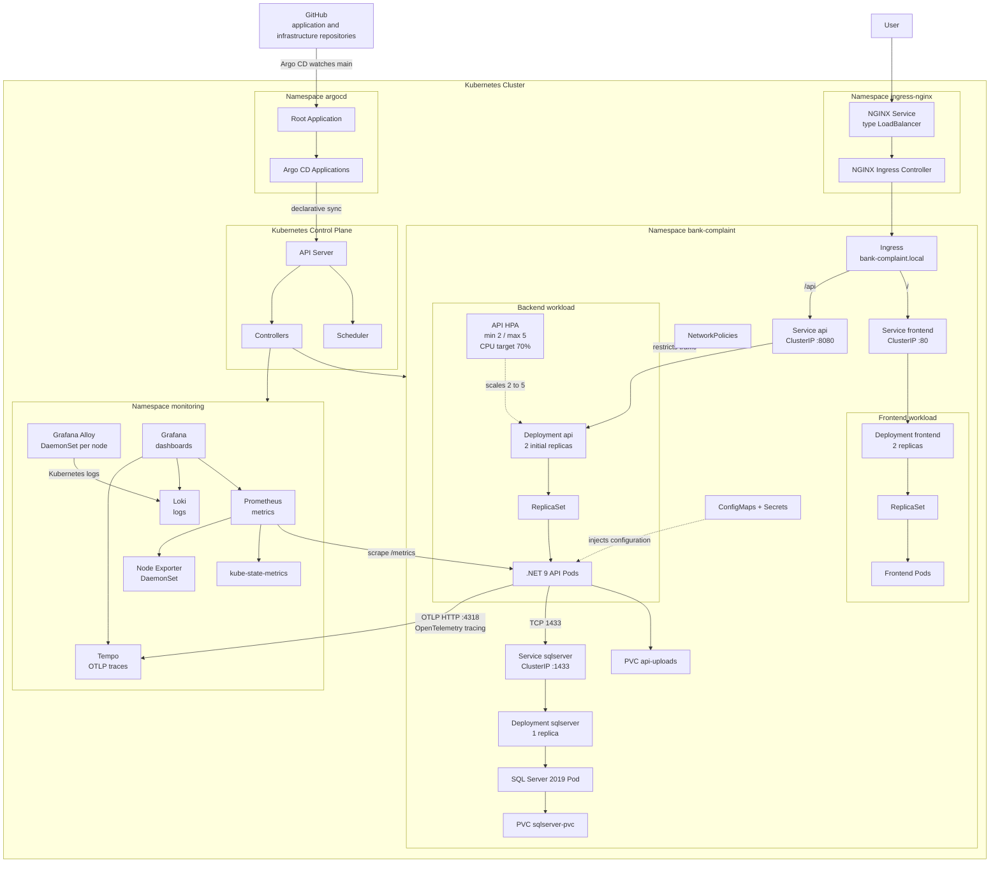

### Simple Application Cluster View

This diagram shows only the actual components deployed in the `bank-complaint` namespace, without detailing the intermediate Kubernetes objects:

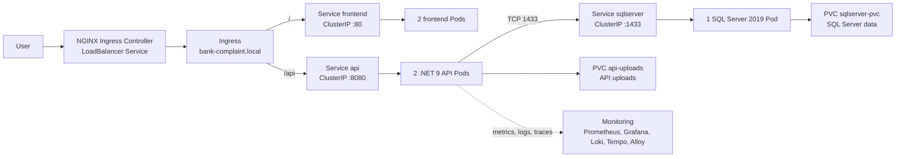

This summarizes the current topology: **2 frontend Pods**, **2 API Pods** and **1 SQL Server Pod**. The HPA can increase the number of API Pods up to 5 according to CPU usage; the two API Pods represent the initial Deployment state.

### Observability Flow Details

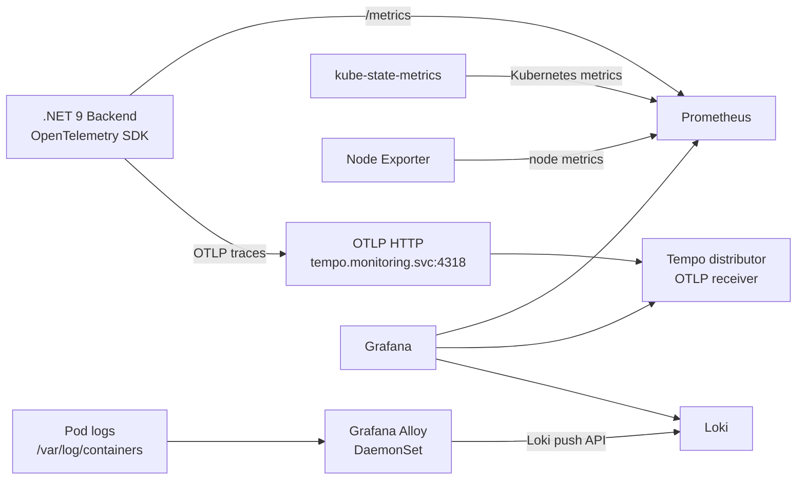

In the current implementation, **Alloy collects Kubernetes pod logs and sends them to Loki**. **OpenTelemetry traces from the backend are sent directly to Tempo over OTLP HTTP on port `4318`**. Tempo also exposes OTLP gRPC on port `4317`. The API NetworkPolicy allows the API-to-Tempo flow on port `4318`.

### Kubernetes Resource Hierarchy

```text
Kubernetes Cluster
├── Namespace argocd
│   ├── Root Application
│   └── Argo CD Applications
├── Namespace ingress-nginx
│   ├── NGINX Ingress Controller Service (LoadBalancer)
│   └── NGINX Ingress Controller Pods
├── Namespace bank-complaint
│   ├── Ingress
│   ├── Service frontend -> Deployment -> ReplicaSet -> Frontend Pods
│   ├── Service api -> Deployment -> ReplicaSet -> API Pods
│   │   └── API HPA: 2 to 5 replicas according to CPU
│   ├── PVC api-uploads
│   ├── Service sqlserver -> Deployment -> SQL Server Pod
│   ├── PVC sqlserver-pvc
│   ├── ConfigMaps and Secrets
│   └── NetworkPolicies
└── Namespace monitoring
    ├── Prometheus
    ├── Grafana
    ├── Loki
    ├── Tempo
    ├── Alloy DaemonSet -> pod logs -> Loki
    ├── kube-state-metrics
    └── Node Exporter DaemonSet
```

In Kubernetes, each object has a specific responsibility:

| Object | Role in this project |
| --- | --- |
| Ingress | Receives HTTP requests and selects the target Service according to `/` or `/api`. |
| Service | Provides a stable network address for Pods. Application Services use `ClusterIP`. |
| Deployment | Declares the desired replica count and manages Pod updates. |
| ReplicaSet | Creates and maintains the number of Pods requested by a Deployment. |
| Pod | Runs the frontend, API or SQL Server container. |
| PVC | Requests persistent storage for SQL Server or API uploads. |
| HPA | Automatically adjusts API Pods between 2 and 5 according to CPU usage. |

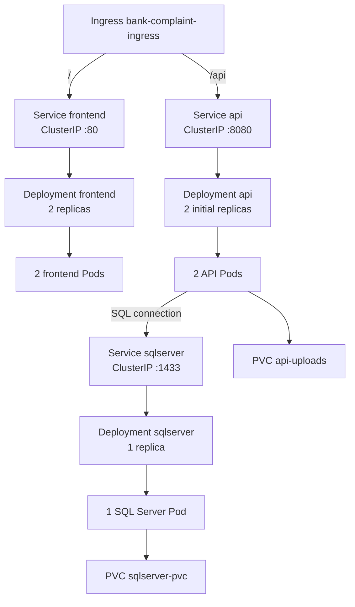

Read the diagram from top to bottom: the Ingress routes to a Service, the Service targets a Deployment, the Deployment manages Pods, and Pods use PVCs when persistent storage is required. The frontend and API start with 2 Pods each, SQL Server has 1 Pod, and the API can scale up to 5 Pods through the HPA.

### Network and Observability Flow

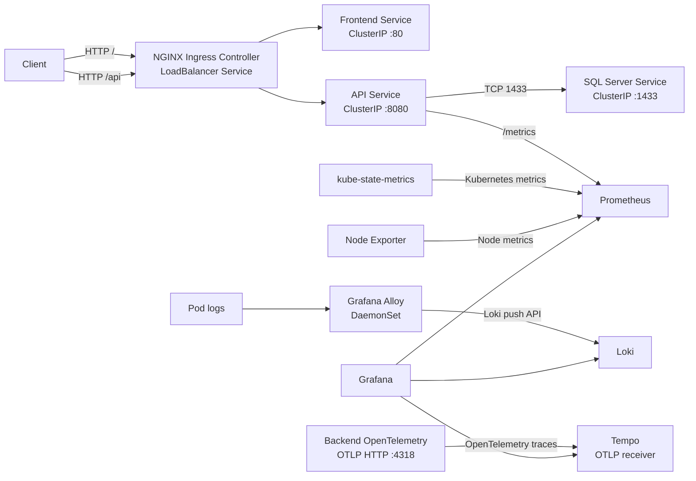

NetworkPolicies restrict the API traffic. Prometheus collects API, Kubernetes and node metrics. Alloy collects Pod logs and sends them to Loki. The OpenTelemetry-instrumented backend sends traces directly to Tempo through OTLP HTTP on port `4318`.

### Request Flow

1. The user accesses `bank-complaint.local` through NGINX Ingress.
2. The `/` path is routed to the frontend Service.
3. The `/api` path is routed to the API Service.
4. The API communicates with SQL Server over the internal cluster network.
5. Prometheus collects metrics exposed by the API and Kubernetes components.
6. Grafana provides an operational view of the collected metrics, logs and traces.

## Overview

The deployed architecture is organized into three main namespaces:

- `bank-complaint`: frontend, backend API, SQL Server and application Services;
- `monitoring`: Prometheus, Grafana, Loki, Tempo, Alloy, kube-state-metrics and Node Exporter;
- `argocd`: Argo CD Applications that declare Git sources and Kubernetes destinations.

Application routing is provided by NGINX Ingress:

| Route | Service | Port |
| --- | --- | --- |
| `http://bank-complaint.local/` | frontend | 80 |
| `http://bank-complaint.local/api` | api | 8080 |

The NGINX Ingress Controller Service uses `LoadBalancer` for external access. The application Services use `ClusterIP` and are not exposed directly.

## Kubernetes Architecture

### Application Components

- **Frontend**: `frontend` Deployment with 2 replicas and an image published to GHCR;
- **Backend**: `api` Deployment with 2 initial replicas and an image published to GHCR;
- **SQL Server**: SQL Server 2019 Deployment with 1 replica and persistent storage;
- **Upload storage**: `api-uploads` PersistentVolumeClaim mounted by the backend;
- **External exposure**: NGINX Ingress Controller Service of type `LoadBalancer`;
- **Routing**: `bank-complaint-ingress` routes `/` to the frontend and `/api` to the API.

The application Services are `ClusterIP` Services. The LoadBalancer Service belongs to the NGINX Ingress Controller, while the Ingress resource defines the HTTP routing rules.

The Deployments define resource requests and limits and use Kubernetes probes to control startup, readiness and liveness. The API and frontend run multiple replicas, while SQL Server uses one replica with persistent storage.

### Kubernetes Security

The manifests apply the following controls:

- non-root execution for application containers;
- disabled privilege escalation and dropped Linux capabilities;
- disabled automatic ServiceAccount token mounting where it is not required;
- `ghcr-secret` for pulling private images from GHCR;
- ConfigMaps for non-sensitive configuration and Secrets for sensitive values;
- NetworkPolicies restricting traffic between the Ingress, API, SQL Server, DNS and observability components.

Sensitive values must be managed through Kubernetes Secrets and must not be committed in plain text.

### Observability

The `monitoring` namespace contains:

- **Prometheus** for metrics collection;
- **Grafana** for dashboards;
- **Loki** for logs;
- **Tempo** for traces;
- **Grafana Alloy** for Kubernetes log collection and observability forwarding;
- **kube-state-metrics** for Kubernetes object metrics;
- **Node Exporter** for node metrics.

The API exposes metrics for Prometheus on port `8080` and path `/metrics`. The backend sends OpenTelemetry traces directly to Tempo through OTLP HTTP on port `4318`, while Alloy collects Kubernetes pod logs and sends them to Loki.

## Technical Decisions and Strengths

### Declarative and Auditable Deployments

The desired cluster state is defined in YAML and versioned in Git. Every infrastructure change is traceable in the repository history and can be reviewed before synchronization.

### Clear Separation of Responsibilities

The application repositories build and publish images. This repository defines how those images run in Kubernetes. Argo CD reconciles Git with the cluster, reducing manual changes and simplifying troubleshooting.

### Version Traceability

The workflows use the commit SHA as the image tag in Kubernetes Deployments. A deployed version can therefore be linked to an exact source commit, supporting incident analysis and rollback.

### Availability and Resource Governance

The API and frontend run with two replicas. Resource requests, limits and probes help Kubernetes schedule workloads and route traffic only to ready Pods. The API HPA can scale from 2 to 5 replicas according to CPU usage.

### Defense in Depth

Non-root identities, restricted capabilities, disabled privilege escalation, Kubernetes Secrets, private image credentials and NetworkPolicies work together to reduce the attack surface.

### Reproducible Operations

The same manifests can be reviewed, validated and synchronized by Argo CD. Docker Compose also provides local execution of the frontend, API and SQL Server components.

## Component Responsibilities

| Component | Responsibility |
| --- | --- |
| Frontend | User interface exposed through the `frontend` Service |
| API | Backend logic, health endpoint, metrics and database access |
| SQL Server | Relational application persistence |
| NGINX Ingress | External routing to the frontend and API |
| Argo CD | Git-to-Kubernetes synchronization, pruning and self-healing |
| Prometheus | Metrics collection |
| Grafana | Visualization and data exploration |
| Loki | Log storage and querying |
| Tempo | Trace storage |
| Alloy | Kubernetes log collection and observability forwarding |

## Kubernetes Architecture and Routing

- **Frontend**: `frontend` Deployment with 2 replicas and an image published to GHCR.
- **Backend**: `api` Deployment with 2 initial replicas and an image published to GHCR.
- **Database**: SQL Server 2019 Deployment with 1 replica and persistent storage.
- **Uploads**: `api-uploads` PersistentVolumeClaim mounted by the backend.
- **External entry point**: NGINX Ingress Controller exposed through a `LoadBalancer` Service.
- **HTTP routing**: the `bank-complaint-ingress` resource routes `/` to `frontend` and `/api` to `api`.
- **Internal services**: `frontend`, `api` and `sqlserver` use `ClusterIP` Services.

The `Ingress` resource does not itself have a `type: LoadBalancer` field. The `LoadBalancer` type belongs to the NGINX Ingress Controller Service. The Ingress resource defines the HTTP routing rules toward the internal application Services.

## Autoscaling

The API has a Kubernetes `HorizontalPodAutoscaler` declared in `k8s/api/hpa.yaml`:

| Parameter | Value |
| --- | --- |
| Minimum replicas | 2 |
| Maximum replicas | 5 |
| Metric | Average CPU utilization |
| Target | 70% |
| Target resource | `api` Deployment |

The HPA behavior is:

1. The API starts with at least 2 replicas.
2. Metrics Server provides CPU usage for the API Pods.
3. When average CPU usage remains above 70%, Kubernetes increases the number of API Pods up to 5.
4. When load decreases, Kubernetes can scale the API down, but never below 2 replicas.
5. The `api` Service continues routing traffic to available and ready Pods.

This scales API Pods, not the number of cluster nodes. Node sizing is managed by the underlying Kubernetes environment. The frontend remains at 2 fixed replicas and SQL Server at 1 replica with persistent storage. The HPA uses the CPU requests defined by the API Deployment, so Metrics Server must be available for autoscaling to work.

## Security and Network Policies

The manifests apply the following controls:

- non-root execution for application containers;
- disabled privilege escalation;
- dropped Linux capabilities for the API and frontend;
- disabled automatic ServiceAccount token mounting where it is not required;
- `ghcr-secret` for private GHCR image pulls;
- ConfigMaps for non-sensitive configuration and Secrets for sensitive values;
- NetworkPolicies limiting traffic between the Ingress, API, SQL Server, DNS, Prometheus and Tempo.

Calico is used as the Minikube CNI so that the NetworkPolicies can be enforced in the local cluster. Sensitive values must not be committed in plain text.

## GitOps with Argo CD

Argo CD uses this repository as the source of truth and watches the `main` branch. The entry point is:

```text
argocd/root-application.yaml
```

The root Application loads the Applications declared in `argocd/apps/`. These Applications target the relevant Kubernetes directories and enable automated synchronization, pruning and self-healing.

The synchronization waves deploy namespaces and foundation components before the frontend and backend workloads.

To install the root Application in a cluster that already has Argo CD:

```bash
kubectl apply -f argocd/namespace.yaml
kubectl apply -f argocd/root-application.yaml
```

The cluster must already provide the external components referenced by the manifests, including an NGINX Ingress Controller and the CRDs required by Argo CD.

## CI/CD Image Delivery

The frontend and backend repositories each contain a GitHub Actions workflow. Pull requests to `main` restore dependencies, build the project and run tests. Pushes to `main` additionally build and publish the Docker image, update this infrastructure repository and trigger the Argo CD synchronization flow.

### Frontend workflow

The frontend workflow installs Node.js 20, runs `npm ci` in `bank-app`, executes unit tests with ChromeHeadless, builds the Docker image, publishes the `${{ github.sha }}` and `latest` tags to GHCR, then updates `k8s/frontend/deployment.yaml` in this repository using `INFRA_REPO_TOKEN`.

### Backend workflow

The backend workflow installs .NET 9, restores `BankComplaintManagement.sln`, builds the Release configuration, runs .NET tests, builds and publishes the `${{ github.sha }}` and `latest` image tags to GHCR, then updates `k8s/api/deployment.yaml` in this repository using `INFRA_REPO_TOKEN`.

### Delivery flow

```text
Push to main in frontend or backend repository
        |
        v
Build + tests + Docker image
        |
        v
Publish image to GHCR
        |
        v
Update Deployment image in this repository
        |
        v
Automatic commit pushed to main
        |
        v
Argo CD detects the change and synchronizes Kubernetes
```

The image SHA tag links a deployed version to an exact source commit, which improves traceability and supports controlled rollback.

The workflows use the following variables and secrets:

| Item | Purpose |
| --- | --- |
| `GITHUB_TOKEN` | Authenticate to GHCR and publish images |
| `INFRA_REPO_TOKEN` | Clone and push changes to this repository from the application repositories |
| `REGISTRY` | Container registry, configured as `ghcr.io` |
| `INFRA_REPO` | `fida-ghourabi/bank-complaint-management-infra` |

## Repository Structure

```text
.
├── argocd/                 # Root Application and Argo CD Applications
├── k8s/                    # Active Kubernetes manifests
│   ├── api/                # Backend, configuration, HPA and upload storage
│   ├── frontend/           # Frontend
│   ├── ingress/            # HTTP routing
│   ├── monitoring/         # Observability stack
│   ├── namespace/          # Application namespace
│   ├── networkpolicy/      # Network policies
│   └── sqlserver/          # Database and persistent storage
├
├── docker-compose.yml      # Local execution of the application stack
└── README.md               # Project documentation
```

The `k8s/` directory is the source used by the Argo CD Applications.

## Work and Runtime Environments

| Environment | Purpose | Technologies and components |
| --- | --- | --- |
| Local development workstation | Develop, verify and run the application locally | Git, VS Code or equivalent IDE, Docker and Docker Compose |
| Kubernetes environment | Run and observe the containerized application | Kubernetes, Argo CD, NGINX Ingress, GHCR and observability stack |

### Local environment

The local environment requires Git, Docker and Docker Compose. `docker-compose.yml` starts the frontend, API and SQL Server on the `bank-network` Docker network:

- frontend: `http://localhost:4200`;
- API: `http://localhost:8080`;
- SQL Server: `localhost:1433`.

### Kubernetes environment

The target environment requires a Kubernetes cluster, Argo CD in `argocd`, the `bank-complaint` and `monitoring` namespaces, an NGINX Ingress Controller exposed through a `LoadBalancer` Service, a StorageClass, GHCR access through `ghcr-secret` and a working Metrics Server for the API HPA.

### Declared application environments

This repository contains a local execution environment and a Kubernetes target synchronized from the `main` branch. It does not contain separate `development`, `staging` and `production` directories or values. Environment differences are managed through cluster configuration, Secrets, ConfigMaps, StorageClasses and platform services.

## Local Cluster Creation with Minikube

The local Kubernetes environment uses **Minikube**, the **Docker** driver and **Calico** as the CNI plugin. Docker Desktop must be running before creating the cluster.

Calico provides Pod networking and enforces the Kubernetes NetworkPolicies declared in `k8s/networkpolicy/`. This makes it possible to test locally the allowed traffic between NGINX Ingress, the API, SQL Server, DNS, Prometheus and Tempo.

Required tools:

- Docker Desktop;
- Minikube;
- `kubectl`;
- Git.

Create and verify the cluster:

```bash
minikube start --driver=docker --cni=calico
kubectl get nodes
minikube status
```

Verify Calico:

```bash
kubectl get pods -n kube-system -l k8s-app=calico-node
kubectl get pods -n kube-system -l k8s-app=calico-kube-controllers
```

Enable the required addons:

```bash
minikube addons enable ingress
minikube addons enable metrics-server
```

The `ingress` addon provides the local NGINX Ingress Controller. The `metrics-server` addon provides CPU metrics used by the API HPA.

Install Argo CD and apply the root Application:

```bash
kubectl apply -f argocd/namespace.yaml
kubectl apply -n argocd -f https://raw.githubusercontent.com/argoproj/argo-cd/stable/manifests/install.yaml
kubectl apply -f argocd/root-application.yaml
```

## Local Application Access

The Ingress hostname is `bank-complaint.local`. With Minikube and the Docker driver, configure local resolution through `127.0.0.1` and keep the Minikube tunnel running.

On Windows, edit:

```text
C:\Windows\System32\drivers\etc\hosts
```

Add:

```text
127.0.0.1 bank-complaint.local
```

In a dedicated terminal, run:

```bash
minikube tunnel
```

Verify the NGINX Service and the Ingress:

```bash
kubectl get svc -n ingress-nginx
kubectl get ingress -n bank-complaint
```

The application is then available at:

```text
http://bank-complaint.local
```

## Required Secrets

Before Argo CD synchronizes the workloads, create the Secrets expected by the manifests:

- `ghcr-secret` in `bank-complaint` for private GHCR image access;
- `api-secret` in `bank-complaint` for API secrets;
- `sqlserver-secret` in `bank-complaint` for the SQL Server password.

Secret values must not be committed in plain text. The expected names and keys are defined in `k8s/api/`, `k8s/sqlserver/` and the examples in `k8s/examples/`.

## Local Docker Compose Execution

The `docker-compose.yml` file runs SQL Server, the API and the frontend on the `bank-network` Docker network. It expects the following environment variables:

```text
SQL_SERVER_PASSWORD
SQL_DATABASE
JWT_SECRET
JWT_ISSUER
JWT_AUDIENCE
JWT_EXPIRATION
ADMIN_FIRSTNAME
ADMIN_LASTNAME
ADMIN_EMAIL
ADMIN_PASSWORD
```

Start the local stack:

```bash
docker compose up -d
```

The declared local ports are `4200` for the frontend, `8080` for the API and `1433` for SQL Server.

## Verification Commands

```bash
kubectl get pods -n bank-complaint
kubectl get pods -n monitoring
kubectl get ingress -n bank-complaint
kubectl get applications -n argocd
kubectl describe application bank-complaint-frontend -n argocd
kubectl describe application bank-complaint-backend -n argocd
kubectl rollout status deployment/api -n bank-complaint
kubectl rollout status deployment/frontend -n bank-complaint
```

## Prerequisites

- a Kubernetes cluster accessible through configured `kubectl`;
- Argo CD installed in the cluster for GitOps;
- an NGINX Ingress Controller exposed through a `LoadBalancer` Service;
- Calico or another CNI compatible with Kubernetes NetworkPolicies;
- a StorageClass compatible with the PersistentVolumeClaims;
- access to GHCR and the Kubernetes `ghcr-secret`;
- application and SQL Server Secrets created in the expected namespaces.

## Project Principles

- **Infrastructure as Code**: Kubernetes resources are versioned;
- **GitOps**: Argo CD synchronizes cluster state from Git;
- **Traceability**: application images use commit SHA tags;
- **Resilience**: the API and frontend run multiple replicas;
- **Secure defaults**: non-root containers, restricted privileges and controlled network flows;
- **Observability**: metrics, logs and traces are part of the platform.

## Project Strengths

- declarative and versioned Infrastructure as Code;
- GitOps synchronization from Git to Kubernetes;
- image traceability through commit SHA tags;
- API and frontend availability through multiple replicas;
- CPU-based API autoscaling from 2 to 5 replicas;
- container hardening with non-root users and restricted privileges;
- Calico-enforced NetworkPolicies;
- metrics, logs and traces collected through Prometheus, Loki, Tempo and Alloy;
- reproducible local execution with Minikube and Docker Compose.

## Links

- Frontend repository: `fida-ghourabi/bank-complaint-management-frontend`
- Backend repository: `fida-ghourabi/bank-complaint-management-backend`
- Container registry: `ghcr.io`
